## 一、Redis 

### 1.1 Redis主从复制

**主从复制：**   一个Redis服务可以有多个该服务的复制品，这个Redis服务称为Master，其它复制称为Slaves

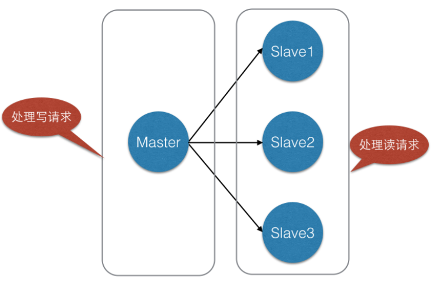

将一台Redis服务器作主库(Matser)，其他三台作为从库(Slave)，主库只负责写数据，每次有数据更新都将更新的数据同步到它所有的从库，而从库只负责读数据。这样一来，就有了两个好处：

1. 读写分离，不仅可以提高服务器的负载能力，并且可以根据读请求的规模自由增加或者减少从库的数量。      

2. 数据被复制成了了好几份，就算有一台机器出现故障，也可以使用其他机器的数据快速恢复。

   

哨兵模式：是基于主从模式做的一定变化，它能够为Redis提供了高可用性。在实际生产中，服务器难免不会遇到一些突发状况：服务器宕机，停电，硬件损坏等。这些情况一旦发生，其后果往往是不可估量的。而哨兵模式在一定程度上能够帮我们规避掉这些意外导致的灾难性后果。其实，哨兵模式的核心还是主从复制。只不过相对于主从模式在主节点宕机导致不可写的情况下，多了一个竞选机制——从所有的从节点竞选出新的主节点。竞选机制的实现，是依赖于在系统中启动一个sentinel进程。

sentinel特点：

监控：它会监听主服务器和从服务器之间是否在正常工作。

通知：它能够通过API告诉系统管理员或者程序，集群中某个实例出了问题。

故障转移：它在主节点出了问题的情况下，会在所有的从节点中竞选出一个节点，并将其作为新的主节点。

提供主服务器地址：它还能够向使用者提供当前主节点的地址。这在故障转移后，使用者不用做任何修改就可以知道当前主节点地址。

原文链接：https://blog.csdn.net/qq_28410283/java/article/details/89197156

### 1.2 Redis Cluster集群

**至少需要3(Master)+3(Slave)才能建立集群**。Redis-Cluster采用无中心结构，每个节点保存数据和整个集群状态,每个节点都和其他所有节点连接。其redis-cluster架构图如右上侧

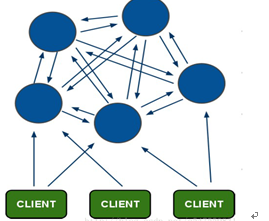

集群特点：

1、所有的redis节点彼此互联(PING-PONG机制),内部使用二进制协议优化传输速度和带宽。
2、节点的fail是通过集群中超过半数的节点检测失效时才生效。
3、客户端与redis节点直连,不需要中间proxy层.客户端不需要连接集群所有节点,连接集群中任何一个可用节点即可。
4、redis-cluster把所有的物理节点映射到[0-16383]slot上（不一定是平均分配）,cluster 负责维护 

5、Redis集群预分好16384个哈希槽，当需要在 Redis 集群中放置一个 key-value 时， redis 先对key 使用 crc16 算法算出一个结果，然后把结果对 16384 求余数，这样每个 key 都会对应一个编号在 0-16383 之间的哈希槽，redis 会根据节点数量大致均等的将哈希槽映射到不同的节点。

**Redis Cluster容错**：**redis-cluster投票**

投票过程是集群中所有master参与,如果半数以上master节点与master节点通信超时(cluster-node-timeout),认为当前master节点挂掉.

**整个集群不可用情况：cluster_state:fail**

集群任意master挂掉,且当前master没有slave.集群进入fail状态,也可以理解成集群的slot映射[0-16383]不完整时进入fail状态. 如果集群超过半数以上master挂掉，无论是否有slave，集群进入fail状态. 

**redis-cluster节点分配**

三个主节点分别是：A, B, C 三个节点：采用哈希槽 (hash slot)的方式来分配16384个slot 的话，它们三个节点分别承担的slot 区间是 

节点A覆盖0－5460;

节点B覆盖5461－10922;

节点C覆盖10923－16383

新增节点的话，从各个节点的其前面个各取一部分slot到D上。


**Redis Cluster主从模式**

redis cluster 为了保证数据的高可用性，加入了主从模式，一个主节点对应一个或多个从节点，主节点提供数据存取，从节点则是从主节点拉取数据备份，当这个主节点挂掉后，就会有这个从节点选取一个来充当主节点，从而保证集群不会挂掉。

### 1.3 Redis持久化

**RDB**：是redis的默认持久化机制。RDB相当于照快照（快照是指向保存在存储设备中的数据的引用标记或指针），保存的是一种状态。几十G数据-->几KB快照

**优点：**快照保存数据极快、还原数据极快，适用于灾难备份。

**缺点：**小内存机器不适合使用,RDB机制符合要求就会照快照

**快照条件**：1、服务器正常关闭时；2、key满足一定条件，会进行快照。

 **AOF**：由于快照方式是在一定间隔时间做一次的，所以如果redis 意外down 掉的话，就会丢失最后一次快照后的所有修改。如果应用要求不能丢失任何修改的话，可以采用aof 持久化方式。

Append-only file:aof 比快照方式有更好的持久化性，在使用aof 持久化方式时,redis 会将每一个收到的写命令都通过write 函数追加到文件（appendonly.aof）中，当redis 重启时会通过重新执行文件中保存的写命令来在内存中重建整个数据库的内容。

**产生问题：**持久化文件会变的越来越大。例如我们调用 incr test命令 100 次，文件中必须保存全部的 100 条命令，其实有 99 条都是多余的。

### 1.4 redis缓存与数据库一致性

**实时同步**：对强一致要求比较高的，应采用实时同步方案，即查询缓存查询不到再从DB查询，保存到缓存；更新缓存时，先更新数据库，再将缓存的设置过期

**异步队列**：对于并发程度较高的，可采用异步队列的方式同步，可采用kafka等消息中间件处理消息生产和消费。

**使用阿里的同步工具canal**：canal实现方式是模拟mysql slave和master的同步机制，监控DB bitlog的日志更新来触发缓存的更新，此种方法可以解放程序员双手，减少工作量

mysql-binlog是MySQL数据库的二进制日志，用于记录用户对数据库操作的SQL语句，除了数据查询语句

### 1.5  缓存穿透和雪崩

**缓存穿透：**指查询一个一定不存在的数据，由于缓存是不命中时需要从数据库查询，查不到数据则不写入缓存，这将导致这个不存在的数据每次请求都要到数据库去查询，造成缓存穿透

**解决办法：** 1、持久层查询不到就缓存空结果，查询时先判断缓存中是否exists(key) ,如果有直接返回空，没有则查询后返回，注意insert时需清除查询的key，否则即便DB中有值也查询不到。2、缓存穿透，将所有可能存在的数据缓存放到布隆过滤器中，当黑客访问不存在的缓存时迅速返回避免缓存及DB挂掉。（布隆过滤器：概率型数据结构，特点是高效地插入和查询，可以用来告诉你 “某样东西一定不存在或者可能存在”。）

**缓存雪崩：**缓存大量失效的时候，引发大量查询数据库。

**解决办法**：①用锁/分布式锁或者队列串行访问； ②缓存失效时间均匀分布

 **热点key**：某个key访问非常频繁，当key失效的时候有大量线程来构建缓存，导致负载增加，系统崩溃。

解决方法：①使用锁，单机用synchronized,lock等，分布式用分布式锁。②缓存过期时间不设置，而是设置在key对应的value里。如果检测到存的时间超过过期时间则异步更新缓存。③在value设置一个比过期时间t0小的过期时间值t1，当t1过期的时候，延长t1并做更新缓存操作。

### 1.6 Redis事务使用场景----Redis乐观锁

乐观锁基于CAS（Compare And Swap）思想（比较并替换），是不具有互斥性，不会产生锁等待而消 耗资源，但是需要反复的重试，但也是因为重试的机制，能比较快的响应。因此我们可以利用redis来实现乐观锁。具体思路如下：
1、利用redis的watch功能，监控这个redisKey的状态值 
2、获取redisKey的值 
3、创建redis事务 
4、 给这个key的值+1
5、然后去执行这个事务，如果key的值被修改过则回滚，key不加1

### 1.7、redis提供的6种数据淘汰策略

```
volatile-lru:从设置了过期时间的数据集中，选择最久未使用的数据释放；
allkeys-lru:从数据集中(包括设置过期时间以及未设置过期时间的数据集中)，选择最近最久未使用的数据释放；
volatile-random:从设置了过期时间的数据集中，随机选择一个数据进行释放；
allkeys-random:从数据集中(包括了设置过期时间以及未设置过期时间)随机选择一个数据进行入释放；
volatile-ttl：从设置了过期时间的数据集中，选择马上就要过期的数据进行释放操作；
noeviction：不删除任意数据(但redis还会根据引用计数器进行释放),这时如果内存不够时，会直接返回错误。
```

### 1.8 Redis面试题

#### 1.8.1 Redis 常见的性能问题都有哪些

（1）、Master 写内存快照，save 命令调度 rdbSave 函数，会阻塞主线程的工作，当快照比较大时对性能影响是非常大的，会间断性暂停服务，所以 Master 最好不要写内存快照。

（2）、Master AOF 持久化，如果不重写 AOF 文件，这个持久化方式对性能的影响是最小的，但是 AOF 文件会不断增大，AOF 文件过大会影响 Master 重启的恢复速度。Master 最好不要做任何持久化工作，包括内存快照和 AOF 日志文件，特别是不要启用内存快照做持久化,如果数据比较关键，某个 Slave 开启 AOF 备份数据，策略为每秒同步一 次。
（3）、Master 调用 BGREWRITEAOF 重写 AOF 文件，AOF 在重写的时候会占大量的 CPU 和内存资源，导致服务 load 过高，出现短暂服务暂停现象。
（4）、Redis 主从复制的性能问题，为了主从复制的速度和连接的稳定性，Slave 和 Master 最好在同一个局域网内

#### 1.8.2 Memcache 与 Redis 的区别都有哪些

（1）、存储方式不同，Memcache 是把数据全部存在内存中，数据不能超过内存的大小，断电后数据库会挂掉。Redis 有部分存在硬盘上，这样能保证数据的持久性。

（2）、数据支持的类型不同 memcahe 对数据类型支持相对简单，redis 有复杂的数据类型。 

（3）、使用底层模型不同 它们之间底层实现方式 以及与客户端之间通信的应用协议不一样。Redis 直接自己构建了 VM 机制 ，因为一般的系统调用系统函数的话，会浪费一定的时间去移动和请求。 

（4）、支持的 value 大小不一样 redis 最大可以达到 1GB，而 memcache 只有 1MB。

#### 1.8.3 Redis 有哪几种数据结构

Redis 的数据结构有五种，分别是： 

String——字符串：String 数据结构是简单的 key-value 类型，value 不仅可以是 String，也可以是数字。

Hash——字典：结构化的信息打包成 hashmap

List——列表：List 说白了就是链表（redis 使用双端链表实现的 List）

Set——集合 ：

Sorted Set——有序集合：

#### 1.8.4  Redis集群方式

Redis集群方式共有三种：主从模式，哨兵模式，cluster(集群)模式。

**主从模式**:是三种集群方式里最简单的。它主要是基于Redis的主从复制特性架构的。通常我们会设置一个主节点，N个从节点;默认情况下，主节点负责处理使用者的IO操作，而从节点则会对主节点的数据进行备份，并且也会对外提供读操作的处理。主要的特点如下：

主从模式下，当某一节点损坏时，因为其会将数据备份到其它Redis实例上，这样做在很大程度上可以恢复丢失的数据。

主从模式下，可以保证负载均衡，这里不再叙说了

主从模式下，主节点和从节点是读写分离的。使用者不仅可以从主节点上读取数据，还可以很方便的从从节点上读取到数据，这在一定程度上缓解了主机的压力。

从节点也是能够支持写入数据的，只不过从从节点写入的数据不会同步到主节点以及其它的从节点下。

不难看出Redis在主从模式下，必须保证主节点不会宕机——一旦主节点宕机，其它节点不会竞争称为主节点，此时，Redis将丧失写的能力。这点在生产环境中，是致命的。

**哨兵模式**：是基于主从模式做的一定变化，它能够为Redis提供了高可用性。在实际生产中，服务器难免不会遇到一些突发状况：服务器宕机，停电，硬件损坏等。这些情况一旦发生，其后果往往是不可估量的。而哨兵模式在一定程度上能够帮我们规避掉这些意外导致的灾难性后果。其实，哨兵模式的核心还是主从复制。只不过相对于主从模式在主节点宕机导致不可写的情况下，多了一个竞选机制——从所有的从节点竞选出新的主节点。竞选机制的实现，是依赖于在系统中启动一个sentinel进程。
sentinel特点：

监控：它会监听主服务器和从服务器之间是否在正常工作。

通知：它能够通过API告诉系统管理员或者程序，集群中某个实例出了问题。

故障转移：它在主节点出了问题的情况下，会在所有的从节点中竞选出一个节点，并将其作为新的主节点。

提供主服务器地址：它还能够向使用者提供当前主节点的地址。这在故障转移后，使用者不用做任何修改就可以知道当前主节点地址。
**Redis集群（cluster）** Redis 集群是一个提供在多个Redis间节点间共享数据的程序集。

#### 1.8.5  Zset的底层实现

有序集合对象的编码可以是ziplist或者skiplist

跳表(skip List)是一种随机化的数据结构，基于并联的链表，实现简单，插入、删除、查找的复杂度均为O(logN)。简单说来跳表也是链表的一种，只不过它在链表的基础上增加了跳跃功能，正是这个跳跃的功能，使得在查找元素时，跳表能够提供O(logN)的时间复杂度。
跳表(skip List)是一种随机化的数据结构，基于并联的链表，实现简单，插入、删除、查找的复杂度均为O(logN)。简单说来跳表也是链表的一种，只不过它在链表的基础上增加了跳跃功能，正是这个跳跃的功能，使得在查找元素时，跳表能够提供O(logN)的时间复杂度。
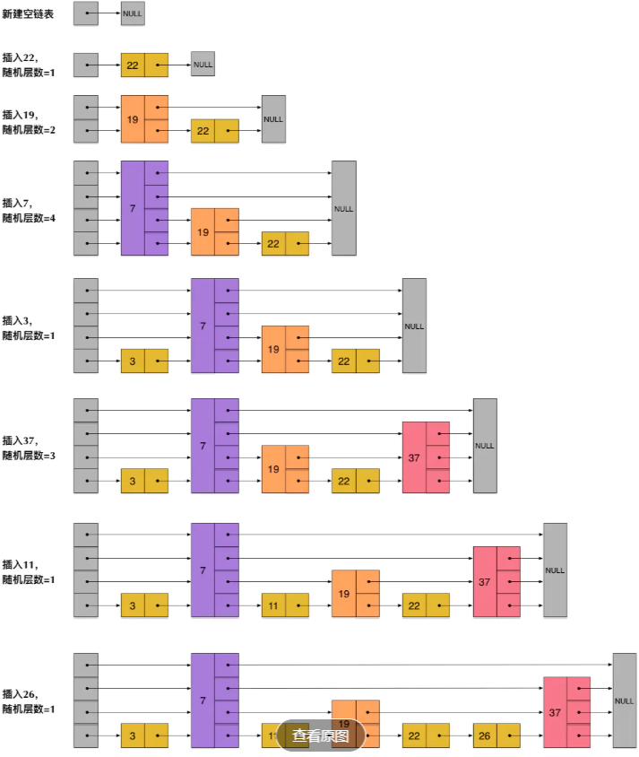


## 二、消息队列 

### 2.1 如何使用 ActiveMQ 解决分布式事务

在互联网应用中，基本都会有用户注册的功能。在注册的同时，我们会做出如下操作： 1. 收集用户录入信息，保存到数据库 2. 向用户的手机或邮箱发送验证码 等等… 

如果是传统的集中式架构，实现这个功能非常简单：开启一个本地事务，往本地数据库中插入一条用户数据，发送验证码，提交事物。 

在分布式架构中，用户和发送验证码是两个独立的服务，它们都有各自的数据库，那么就不能通过本地事物保证操作的原子性。这时我们就需要用到 ActiveMQ（消息队列）来为我们实现这个需求。 在用户进行注册操作的时候，我们为该操作创建一条消息，当用户信息保存成功时，把这条消息发送到消息队列。验证码系统会监听消息，一旦接受到消息，就会给该用户发送验证码。

1.如何防止消息重复发送？ 

解决方法很简单：增加消息状态表。通俗来说就是一个账本，用来记录消息的处理状态，每次处理消息之前，都去状态表中查询一次，如果已经有相同的消息存在，那么不处理，可以防止重复发送。

### 2.2 了解哪些消息队列

ActiveMQ、RabbitMQ、kafka。

**RabbitMQ** 是使用 Erlang 编写的一个开源的消息队列，本身支持很多的协议：AMQP，XMPP, SMTP, STOMP， 也正因如此，它非常重量级，更适合于企业级的开发。同时实现了 Broker 构架，这意味着消息在发送给客户端时先在中心队列排队。对路由，负载均衡或者数据持久化都有很好的支持

**ActiveMQ** 是 Apache 下的一个子项目。 类似于 ZeroMQ，它能够以代理人和点对点的技术实现队列。同时类似
于 RabbitMQ，它少量代码就可以高效地实现高级应用场景。

**Kafka** 是 Apache 下的一个子项目，是一个高性能跨语言分布式发布/订阅消息队列系统，而 Jafka 是在 Kafka 之 上孵化而来的，即 Kafka 的一个升级版。具有以下特性：快速持久化，可以在 O(1)的系统开销下进行消息持久化；高吞吐，在一台普通的服务器上既可以达到 10W/s 的吞吐速率；完全的分布式系统，Broker、Producer、Consumer 都 原生自动支持分布式，自动实现负载均衡；

### 2.3 Kafka 概述

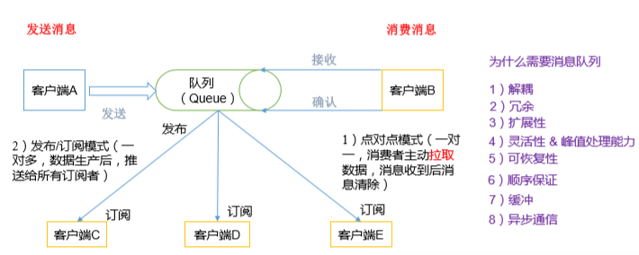

（1）点对点模式（一对一，消费者主动拉取数据，消息收到后消息清除） 
点对点模型通常是一个基于拉取或者轮询的消息传送模型，这种模型从队列中请求信息，而不是将消息推送到客户端。这个模型的特点是发送到队列的消息被一个且只有一个接收者接收处理，即使有多个消息监听者也是如此。 
（2）发布/订阅模式（一对多，数据生产后，推送给所有订阅者） 
发布订阅模型则是一个基于推送的消息传送模型。发布订阅模型可以有多种不同的订阅者，临时订阅者只在主动监听主题时才接收消息，而持久订阅者则监听主题的所有消息，即使当前订阅者不可用，处于离线状

### 2.4 Kafka 架构 


1）Producer ：消息生产者，就是向 kafka broker 发消息的客户端； 
2）Consumer ：消息消费者，向 kafka broker 取消息的客户端； 
3）Topic ：可以理解为一个队列；

4） Consumer Group （CG）：这是kafka用来实现一个topic消息的广播（发给所有的consumer）和单播（发给任意一个 consumer）的手段。一个 topic 可以有多个 CG .

5）Broker ：一台 kafka 服务器就是一个 broker。一个集群由多个 broker 组成。一个 broker可以容纳多个 topic； 

6）Partition：为了实现扩展性，一个非常大的 topic 可以分布到多个 broker（即服务器）上，一个 topic 可以分为多个 partition，每个 partition 是一个有序的队列。partition 中的每条消息都会被分配一个有序的 id（offset）。kafka 只保证按一个 partition 中的顺序将消息发给consumer，不保证一个 topic 的整体（多个 partition 间）的顺序；

7）Offset：kafka 的存储文件都是按照 offset.kafka 来命名，用 offset 做名字的好处是方便查找。例如你想找位于 2049 的位置，只要找到 2048.kafka 的文件即可。当然 the first offset 就
是 00000000000.kafka 

### 2.5  Kafka 生产过程分析 

#### 2.5.1写入方式 

producer 采用推（push）模式将消息发布到 broker，每条消息都被追加（append）到分区（ patition）中，属于顺序写磁盘（顺序写磁盘效率比随机写内存要高，保障 kafka 吞吐率）。 

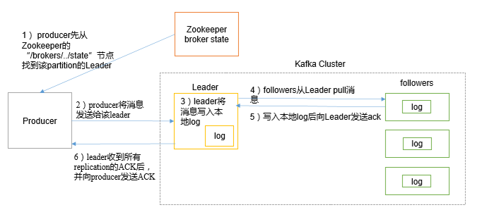

1）producer 先从 zookeeper 的 "/brokers/.../state"节点找到该 partition 的 leader 
2）producer 将消息发送给该 leader 
3）leader 将消息写入本地 log 
4）followers 从 leader pull 消息，写入本地 log 后向 leader 发送 ACK (0-1-ALL)

5）leader 收到所有 ISR 中的 replication 的 ACK 后，增加 HW（high watermark，最后 commit 的 offset）并向 producer 发送 ACK 

**分区的原因** 
（1）方便在集群中扩展，每个 Partition 可以通过调整以适应它所在的机器，而一个topic 又可以有多个 Partition 组成，因此整个集群就可以适应任意大小的数据了； 
（2）可以提高并发，因为可以以 Partition 为单位读写了。 

#### 2.5.2 Broker 保存消息 

物理上把 topic 分成一个或多个 patition（对应 server.properties 中的 num.partitions=3 配置），每个 patition 物理上对应一个文件夹（该文件夹存储该 patition 的所有消息和索引文件）

Zookeeper 存储结构中，consumer也可以存储在broker中

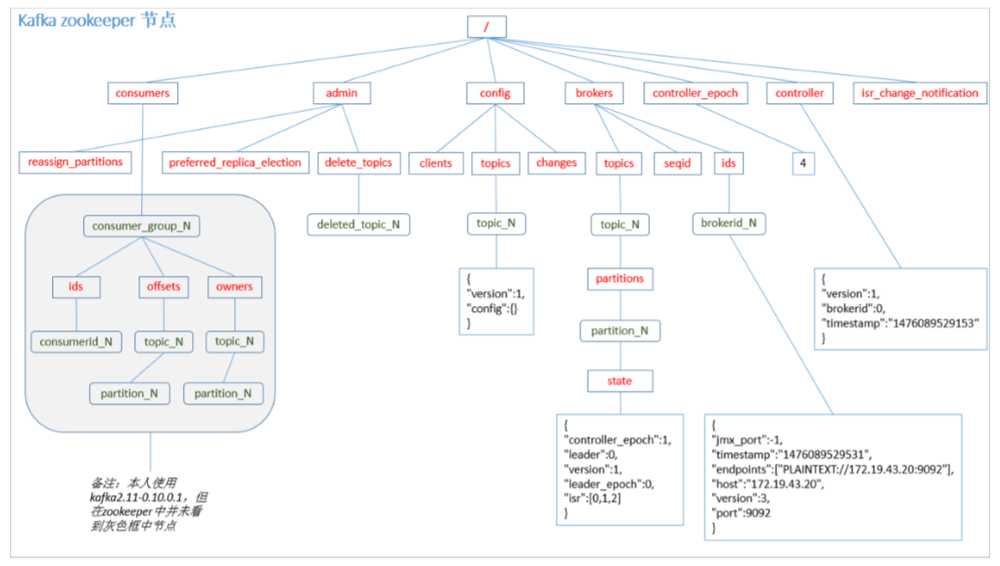

#### 2.5.3  Kafka 消费过程分析 

kafka 提供了两套 consumer API：高级 Consumer API 和低级 Consumer API

**高级 Consumer API** 

1）高级 API 优点 
高级 API 写起来简单 
不需要自行去管理 offset，系统通过 zookeeper 自行管理。 
不需要管理分区，副本等情况，.系统自动管理。 
消费者断线会自动根据上一次记录在 zookeeper 中的 offset 去接着获取数据（默认设置1 分钟更新一下 zookeeper 中存的 offset） 
可以使用 group 来区分对同一个 topic 的不同程序访问分离开来（不同的 group 记录不
同的 offset，这样不同程序读取同一个 topic 才不会因为 offset 互相影响） 
2）高级 API 缺点 
不能自行控制 offset（对于某些特殊需求来说） 
不能细化控制如分区、副本、zk 等 

**低级 Consumer API**
1）低级 API 优点
能够让开发者自己控制 offset，想从哪里读取就从哪里读取。 
自行控制连接分区，对分区自定义进行负载均衡 
对 zookeeper 的依赖性降低（如：offset 不一定非要靠 zk 存储，自行存储 offset 即可，
比如存在文件或者内存中） 
2）低级 API 缺点 
太过复杂，需要自行控制 offset，连接哪个分区，找到分区 leader 等。  

**消费方式** 

consumer 采用 pull（拉）模式从 broker 中读取数据。 

push（推）模式很难适应消费速率不同的消费者，因为消息发送速率是由 broker 决定的。它的目标是尽可能以最快速度传递消息，但是这样很容易造成 consumer 来不及处理消息，典型的表现就是拒绝服务以及网络拥塞。而 pull 模式则可以根据 consumer 的消费能力以适当的速率消费消息。 
对于 Kafka 而言，pull 模式更合适，它可简化 broker 的设计，consumer 可自主控制消费消息的速率，同时 consumer 可以自己控制消费方式——即可批量消费也可逐条消费，同时还能选择不同的提交方式从而实现不同的传输语义。 
pull 模式不足之处是，如果 kafka 没有数据，消费者可能会陷入循环中，一直等待数据到达。为了避免这种情况，我们在我们的拉请求中有参数，允许消费者请求在等待数据到达的“长轮询”中进行阻塞

### 2.6Kafka producer拦截器(interceptor)

interceptor使得用户在消息发送前以及producer回调逻辑前有机会对消息做一些定制化需求，比如修改消息等。同时，producer允许用户指定多个interceptor按序作用于同一条消息从而形成一个拦截链

## 三、Dubbo

### 3.1 Dubbo 的容错机制有哪些

1）Failover Cluster 模式 失败自动切换，当出现失败，重试其它服务器。(默认)
2）Failfast Cluster 快速失败，只发起一次调用，失败立即报。 通常用于非幂等性的写操作，比如新增记录。
3）Failsafe Cluster 失败安全，出现异常时，直接忽略。 通常用于写入审计日志等操作。
4）Failback Cluster 失败自动恢复，后台记录失败请求，定时重发。 通常用于消息通知操作。
5）Forking Cluster 并行调用多个服务器，只要一个成功即返回。通常用于实时性要求较高的读操作，但需要浪费更多服务资源。可通过 forks=”2”来设置最大并行数。

6）Broadcast Cluster 广播调用所有提供者，逐个调用，任意一台报错则报错。(2.1.0 开始支持) 通常用于通知所有提供者更新缓存或日志等本地资源信息。

总结： 在实际应用中查询语句容错策略建议使用默认 Failover Cluster ，而增删改建议使用 Failfast Cluster 或者使用 Failover Cluster（retries=”0”） 策略

### 3.2 Dubbo 的连接方式有哪些

Dubbo广播 ：dubbo 官方入门程序所使用的连接方式，但是这种方式有很多问题。在企业开发中，不使用广播的方式。

Dubbo直连：这种方式在企业中一般在开发中环境中使用，但是生产环境很少使用，因为服务是直接调用，没有使用注册中心，很难对服务进行管理。

zookeeper注册中心 Dubbo：注册中心和广播注册中心配置类似，不过需要指定注册中心类型和注册中心地址，这个时候就不是把服务信息进行广播了，而是告诉给注册中心进行管理，这个时候我们就需要有一个注册中心。

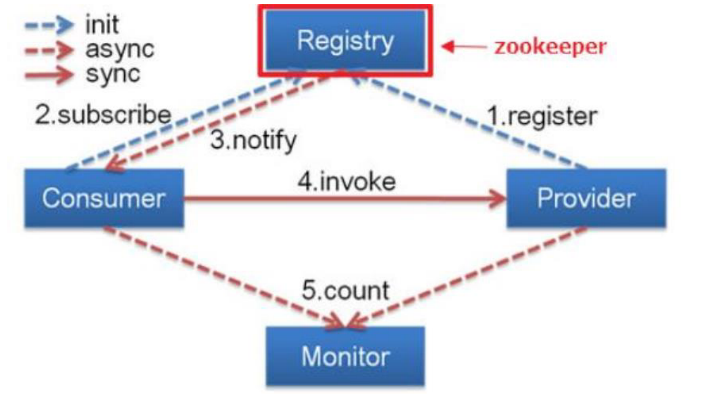

1）Provider: 暴露服务的服务提供方。 2）Consumer: 调用远程服务的服务消费方。 3）Registry: 服务注册与发现的注册中心。 4) Monitor: 统计服务的调用次调和调用时间的监控中心。 5)Container: 服务运行容器。

调用关系说明：
1)服务容器负责启动，加载，运行服务提供者。 2)服务提供者在启动时，向注册中心注册自己提供的服务。 3)服务消费者在启动时，向注册中心订阅自己所需的服务。 4)注册中心返回服务提供者地址列表给消费者，如果有变更，注册中心将基于长连接推送变更数据给消费者。 5)服务消费者，从提供者地址列表中，基于软负载均衡算法，选一台提供者进行调用，如果调用失败，再选另一台调用。 6)服务消费者和提供者，在内存中累计调用次数和调用时间，定时每分钟发送一次统计数据到监控中心。

### 3.3  RPC

RPC【Remote Procedure Call】是指远程过程调用，是一种进程间通信方式，他是一种技术的思想，而不是规范。它允许程序调用另一个地址空间（通常是共享网络的另一台机器上）的过程或函数，而不用程序员显式编码这个远程调用的细节。即程序员无论是调用本地的还是远程的函数，本质上编写的调用代码基本相同

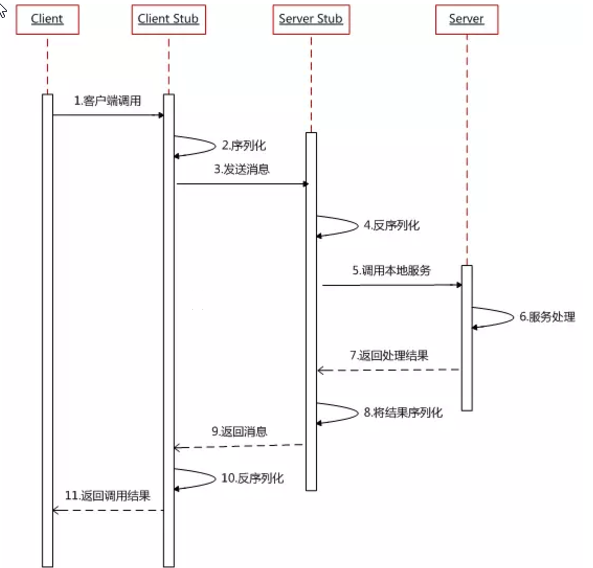

### 3.4  zookeeper宕机与dubbo直连

现象：zookeeper注册中心宕机，还可以消费dubbo暴露的服务。

健壮性

l  监控中心宕掉不影响使用，只是丢失部分采样数据

l  数据库宕掉后，注册中心仍能通过缓存提供服务列表查询，但不能注册新服务

l  注册中心对等集群，任意一台宕掉后，将自动切换到另一台

l  注册中心全部宕掉后，服务提供者和服务消费者仍能通过本地缓存通讯

l  服务提供者无状态，任意一台宕掉后，不影响使用

l  服务提供者全部宕掉后，服务消费者应用将无法使用，并无限次重连等待服务提供者恢复

### 3.5  集群下dubbo负载均衡配置

在集群负载均衡时，Dubbo 提供了多种均衡策略，缺省为 random 随机调用。

**Random LoadBalance**
随机，按权重设置随机概率。
在一个截面上碰撞的概率高，但调用量越大分布越均匀，而且按概率使用权重后也比较均匀，有利于动态调整提供者权重。
**RoundRobin LoadBalance**
轮循，按公约后的权重设置轮循比率。
存在慢的提供者累积请求的问题，比如：第二台机器很慢，但没挂，当请求调到第二台时就卡在那，久而久之，所有请求都卡在调到第二台上。
**LeastActive LoadBalance**
最少活跃调用数，相同活跃数的随机，活跃数指调用前后计数差。
使慢的提供者收到更少请求，因为越慢的提供者的调用前后计数差会越大。
**ConsistentHash LoadBalance**
一致性 Hash，相同参数的请求总是发到同一提供者。
当某一台提供者挂时，原本发往该提供者的请求，基于虚拟节点，平摊到其它提供者，不会引起剧烈变动。

### 3.6 整合hystrix，服务熔断与降级处理

**服务降级：**当服务器压力剧增的情况下，根据实际业务情况及流量，对一些服务和页面有策略的不处理或换种简单的方式处理，从而释放服务器资源以保证核心交易正常运作或高效运作。

可以通过服务降级功能临时屏蔽某个出错的非关键服务，并定义降级后的返回策略。

向注册中心写入动态配置覆盖规则：

Hystrix 旨在通过控制那些访问远程系统、服务和第三方库的节点，从而对延迟和故障提供更强大的容错能力。Hystrix具备拥有回退机制和断路器功能的线程和信号隔离，请求缓存和请求打包，以及监控和配置等功能

## 四、Zookeeper

### 4.1 zookeeper 以及 zookeeper 的原理

ZooKeeper 是一个分布式的，开放源码的分布式应用程序协调服务，它是一个为分布式应用提供一致性服务的软件.


提供的服务包括：统一命名服务、统一配置管理、统一集群管理、服务器节点动态上下线、软负载均衡等。

ZooKeeper 的基本运转流程:1、选举 Leader。2、同步数据。3、选举 Leader 过程中算法有很多，但要达到的选举标准是一致的。 4、Leader 要具有最高的执行 ID，类似 root 权限。5、集群中大多数的机器得到响应并 follow选出的 Leader。

Zookeeper从设计模式角度来理解：是一个基于观察者模式设计的分布式服务管理框架，它负责存储和管理大家都关心的数据，然后接受观察者的注册，一旦这些数据的状态发生变化，Zookeeper就将负责通知已经在Zookeeper上注册 的那些观察者做出相应的反应。

ZooKeeper数据模型的结构与Unix文件系统很类似，整体上可以看作是一棵树，每个节点称做一个ZNode。每一个ZNode默认能够存储1MB的数据，每个ZNode都可以通过其路径唯一标识。

### 4.2 Zookeeper特点 

1）Zookeeper：一个领导者（Leader），多个跟随者（Follower）组成的集群。 

2）集群中只要有半数以上节点存活，Zookeeper集群就能正常服务。 

3）全局数据一致：每个Server保存一份相同的数据副本，Client无论连接到哪个Server，数据都是一致的。
4）更新请求顺序进行，来自同一个Client的更新请求按其发送顺序依次执行。 

5）数据更新原子性，一次数据更新要么成功，要么失败。 

6）实时性，在一定时间范围内，Client能读到最新数据

### 4.3 监听器原理

监听原理详解：


1）首先要有一个main()线程 

2）在main线程中创建Zookeeper客户端，这时就会创建两个线程，一个负责网络连接通信（connet），一个负责监听（listener）。 

3）通过connect线程将注册的监听事件发送给Zookeeper。 

4）在Zookeeper的注册监听器列表中将注册的监听事件添加到列表中。 

5）Zookeeper监听到有数据或路径变化，就会将这个消息发送给listener线程。 

6）listener线程内部调用了process()方法。

### 4.4 选举机制

1）半数机制：集群中半数以上机器存活，集群可用。所以 Zookeeper 适合安装奇数台服务器。 

2）Zookeeper 虽然在配置文件中并没有指定Master 和 Slave。但是，Zookeeper 工作时， 是有一个节点为 Leader，其他则为 Follower，Leader 是通过内部的选举机制临时产生的。

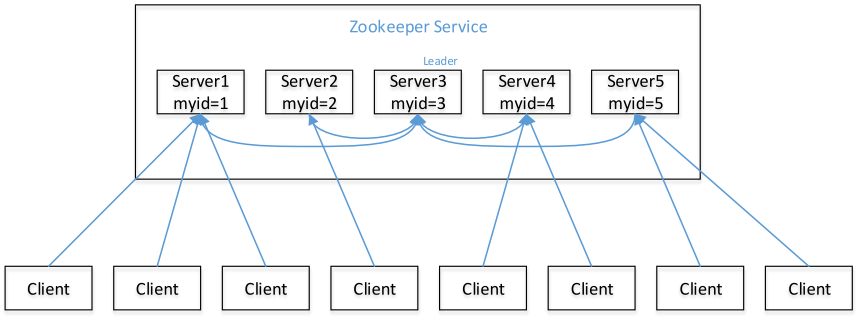

（1）服务器 1 启动，发起一次选举。服务器 1 投自己一票。此时服务器 1 票数一票，不够半数以上（3 票），选举无法完成，服务器 1 状态保持为 LOOKING；

2）服务器 2 启动，再发起一次选举。服务器 1 和 2 分别投自己一票并交换选票信息：此时服务器 1 发现服务器 2 的 ID 比自己目前投票推举的（服务器 1）大，更改选票为推举 服务器 2。此时服务器 1 票数 0 票，服务器 2 票数 2 票，没有半数以上结果，选举无法完成， 服务器 1，2 状态保持 LOOKING 

（3）服务器 3 启动，发起一次选举。此时服务器 1 和 2 都会更改选票为服务器 3。此次投票结果：服务器 1 为 0 票，服务器 2 为 0 票，服务器 3 为 3 票。此时服务器 3 的票数已 经超过半数，服务器 3 当选 Leader。服务器 1，2 更改状态为 FOLLOWING，服务器 3 更改 状态为 LEADING； 

（4）服务器 4 启动，发起一次选举。此时服务器 1，2，3 已经不是 LOOKING 状态，不会更改选票信息。交换选票信息结果：服务器 3 为 3 票，服务器 4 为 1 票。此时服务器 4 服从多数，更改选票信息为服务器 3，并更改状态为 FOLLOWING； 

（5）服务器 5 启动，同 4 一样当小弟。

### 4.5 Zookeeper 写数据流程

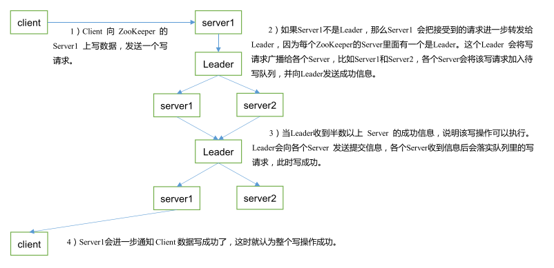

## 五 SpringCloud

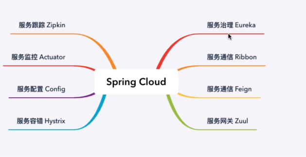

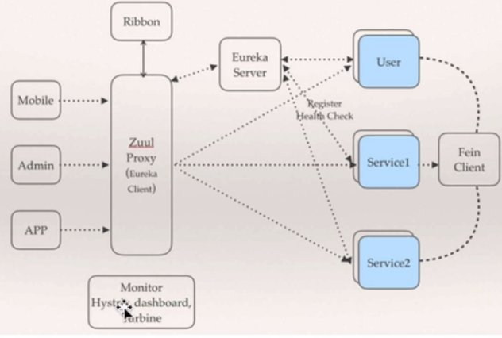

### 5.1 Eureka

Eureka是微服务中心，本身是一个基于 REST 的服务，主要用于定位运行在 AWS域中的中间层服务，以达到 负载均衡和中间层服务故障转移的目的。

Eureka 就是一个专门用于服务发现的服务器，一些服务注册到该服务器，而另一些服务通过该服务器查找其所要调用执行的服务。可以充当服务发现服务器的组件很多，例 如 Zookeeper、Consul、Eureka 等。

### 5.2 Ribbon

Ribbon 是 Netflix 公司的一个开源的负载均衡项目，是一个客户端负载均衡器，运行在消费者端。

### 5.3 Feign

与 Ribbon ⼀一样，Feign 也是由 Netflix 提供的，Feign 是⼀一个声明式、模版化的 Web Service 客户端， 它简化了了开发者编写 Web 服务客户端的操作，开发者可以通过简单的接⼝口和注解来调⽤用 HTTP API， Spring Cloud Feign，它整合了了 Ribbon 和 Hystrix，具有可插拔、基于注解、负载均衡、服务熔断等一 系列列便便捷功能。

### 5.4 Hystrix

1、服务隔离机制 2、服务降级机制 3、熔断机制 4、提供实时的监控和报警功能 5、提供实时的配置修改功能
Hystrix

#### 5.4.1 雪崩效应

在复杂的系统中，经常会出现 A 依赖于 B，B 依赖于 C，C 依赖于 D，……这种依赖将会产生很长的调用链路，这种复杂的调用链路称为 1->N 的扇出。 如果在 A 的调用链路上某一个或几个被调用的子服务不可用或延迟较高，则会导致调用A 服务的请求被堵住。 堵住的 A 请求会消耗占用系统的线程、IO 等资源，当对 A 服务的请求越来越多，占用的计算机资源越来越多的时候，会导致系统瓶颈出现，造成其他的请求同样不可用，最终导致业务系统崩溃，这种现象称为雪崩效应。

### 5.5 微服务网关 Zuul

Zuul 是 Netflix 提供的⼀一个开源的 API ⽹网关服务器器，是客户端和⽹网站后端所有请求的中间层，对外开放 ⼀一个 API，将所有请求导⼊入统⼀一的⼊入⼝口，屏蔽了了服务端的具体实现逻辑，Zuul 可以实现反向代理理的功 能，在⽹网关内部实现动态路路由、身份认证、IP 过滤、数据监控等。

## 六 GIT

6.1 GIT常用指令

```bash
工作区-->暂存区-->版本库
 $ git init  //通过git init命令把这个目录变成Git可以管理的仓
 $ git add readme.txt  //把文件添加到仓库
 $ git commit -m "wrote a readme file"  //git commit告诉Git，把文件提交到仓库：
 
 $ git status //掌握仓库当前的状态
 $ git diff readme.txt  //查看具体修改 ，然后Git add /git commit 进行提交
 $ git diff HEAD -- readme.txt  //工作区和版本库里面最新版本的区别
 
 
 $ git log //查看历史记录，--pretty=oneline参数，对输出数据进行简化
 $ git reset --hard HEAD^ //回退到上一个版本,也可以直接写版本号
 $ git reflog //记录你的每一次命令
 
 $ git checkout -- readme.txt //可以丢弃工作区的修改,文件回到最近一次git commit或git add时的状态

$ git rm test.txt 
$ git commit -m "remove test.txt" //版本库中删除该文件

$ git remote add origin git@github.com:michaelliao/learngit.git
$ git push -u origin master //本地库的所有内容推送到远程库
$ git clone git@github.com:michaelliao/gitskills.git //远程库克隆一个本地库

$ git branch dev
$ git checkout dev //创建dev分支，然后切换到dev分支
$ git branch //查看当前分支
$ git switch master //切换到master分支
$ git merge dev //git merge命令用于合并指定分支到当前分支
$ git branch -d dev  //删除dev分支

$ git merge feature1 //文件存在冲突，必须手动解决冲突后再提交
$ git status //告诉我们冲突的文件,修改后进行提交
$ git log --graph命令可以看到分支合并图
//配置用户名和密码
git config --global user.name  "username"  
git config --global user.email  "email"

git config  user.name  "username"  
git config  user.email  "email"
```


## 七 、Docker

#### 7.1 docker是什么

将应用运行在 Docker 容器上面，而 Docker 容器在任何操作系统上都是一致的，这就实现了跨平台、跨服务器。只需要一次配置好环境，换到别的机子上就可以一键部署好，大大简化了操作。

Linux 容器不是模拟一个完整的操作系统，而是对进程进行隔离。有了容器，就可以将软件运行所需的所有资源打包到一个隔离的容器中。容器与虚拟机不同，不需要捆绑一整套操作系统，只需要软件工作所需的库资源和设置。系统因此而变得高效轻量并保证部署在任何环境中的软件都能始终如一地运行。

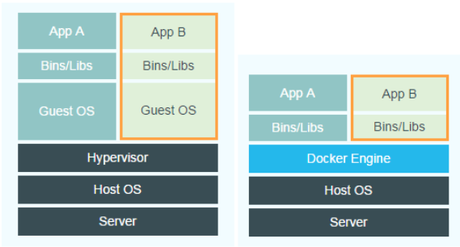

 **Docker 和传统虚拟化方式**的不同之处：

*传统虚拟机技术是虚拟出一套硬件后，在其上运行一个完整操作系统，在该系统上再运行所需应用进程；

*而容器内的应用进程直接运行于宿主的内核，容器内没有自己的内核，而且也没有进行硬件虚拟。因此容器要比传统虚拟机更为轻便。

\* 每个容器之间互相隔离，每个容器有自己的文件系统 ，容器之间进程不会相互影响，能区分计算资源。

(1)docker有着比虚拟机更少的抽象层。由亍docker不需要Hypervisor实现硬件资源虚拟化,运行在docker容器上的程序直接使用的都是实际物理机的硬件资源。因此在CPU、内存利用率上docker将会在效率上有明显优势。

 (2)docker利用的是宿主机的内核,而不需要Guest OS。因此,当新建一个容器时,docker不需要和虚拟机一样重新加载一个操作系统内核。仍而避免引寻、加载操作系统内核返个比较费时费资源的过程,当新建一个虚拟机时,虚拟机软件需要加载Guest OS,返个新建过程是分钟级别的。而docker由于直接利用宿主机的操作系统,则省略了返个过程,因此新建一个docker容器只需要几秒钟

#### 7.2 docker 常用命令

```bash
#镜像命令
$docker images -a:列出本地所有的镜像（含中间） -q:只显示镜像ID --digests： 显示镜像的摘要信息 
$docker search 镜像名  从官网搜索镜像
$docker pull 镜像名[:tag] 下载镜像 
$docker rmi -f 镜像ID 
$docker rmi -f $(docker images -qa)
$docker commit -m="描述信息" -a="作者" 目标镜像名：[标签名]#镜像的提交

#容器命令
$docker run [OPTIONS] IMAGE [COMMAND]
#[OPTIONS] --name:容器指定名称 -d:后台运行 -i:交互模式运行 -t:分配伪终端 -P:随机端口映射 -p:指点端口映射（hostport:containerport）
$docker run -it centos /bin/bash 
#使用镜像centos以交互模式启动一个容器,在容器内执/bin/bash命令。
$docker ps [OPTIONS]  #列出所有正在运行的容器
#-a :列出当前所有正在运行的容器+历史上运行过的
#-l :显示最近创建的容器。
#-n：显示最近n个创建的容器。
#-q :静默模式，只显示容器编号。
#--no-trunc :不截断输出
exit #容器停止退出  
crtl+P+Q#容器不停止退出
$docker start 容器ID或者容器名 #启动容器
$docker restart 容器ID或者容器名 #重启容器
$docker stop 容器ID或者容器名 #停止容器
$docker kill 容器ID或者容器名 #强制停止容器
$docker rm -f $(docker ps -a -p) #一次性删除多个容器

#进入正在运行的容器并以命令交互
$docker exec -it 容器ID bashShell#会启动新的进程
$docker attach 容器ID#不会开启新的进程

#从容器内拷贝文件到主机上
$docker cp 容器ID：容器内路径 目的主机路径

#docker-machine 是docker官方提供的docker管理工具
$ docker-machine version 查看docker-machine版本
$ docker-machine create -d virtualbox default
$ docker-machine create --engine-registry-mirror=https://opl93tto.mirror.aliyuncs.com -d virtualbox default2 #创建machine
$docker-machine ls  #查看docker
$docker-machine env vm_docker #vm的环境变量
```

#### 7.3 Docker容器数据卷

 卷就是目录或文件，存在于一个或多个容器中，由docker挂载到容器，但不属于联合文件系统，因此能够绕过Union File System提供一些用于持续存储或共享数据的特性：

特点：

1：数据卷可在容器之间共享或重用数据

2：卷中的更改可以直接生效

3：数据卷中的更改不会包含在镜像的更新中

4：数据卷的生命周期一直持续到没有容器使用它为止

```bash
$ docker run -it -v /宿主机目录:/容器内目录 centos /bin/bash
$ docker inspect 容器ID
```

#### 7.4 DockerFIle 构建

Dockerfile、Docker镜像与Docker容器分别代表软件的三个不同阶段，

\*  Dockerfile是软件的原材料

\*  Docker镜像是软件的交付品

\*  Docker容器则可以认为是软件的运行态。

1 Dockerfile，需要定义一个Dockerfile，Dockerfile定义了进程需要的一切东西。Dockerfile涉及的内容包括执行代码或者是文件、环境变量、依赖包、运行时环境、动态链接库、操作系统的发行版、服务进程和内核进程(当应用进程需要和系统服务和内核进程打交道，这时需要考虑如何设计namespace的权限控制)等等;

 2 Docker镜像，在用Dockerfile定义一个文件之后，docker build时会产生一个Docker镜像，当运行 Docker镜像时，会真正开始提供服务;

 3 Docker容器，容器是直接提供服务的

**DockerFile 保留字指令**

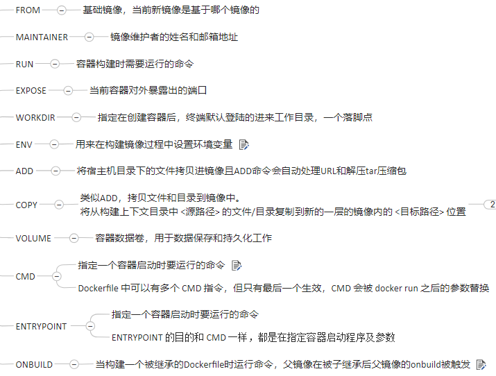

 ```bash
#编写
FROM centos
MAINTAINER zzyy<zzyy167@126.com>

ENV MYPATH /usr/local
WORKDIR $MYPATH

RUN yum -y install vim
RUN yum -y install net-tools

EXPOSE 80

CMD echo $MYPATH
CMD echo "success--------------ok"
CMD /bin/bash

#构建
$docker build -t mycentos:1.3 . #. 表示当前目录
#运行
$docker run -it mycentos:1.3
 ```

案例自定义镜像Tomcat9

```bash

FROM         centos
MAINTAINER    zzyy<zzyybs@126.com>
#把宿主机当前上下文的c.txt拷贝到容器/usr/local/路径下
COPY c.txt /usr/local/cincontainer.txt
#把java与tomcat添加到容器中
ADD jdk-8u171-linux-x64.tar.gz /usr/local/
ADD apache-tomcat-9.0.8.tar.gz /usr/local/
#安装vim编辑器
RUN yum -y install vim
#设置工作访问时候的WORKDIR路径，登录落脚点
ENV MYPATH /usr/local
WORKDIR $MYPATH
#配置java与tomcat环境变量
ENV JAVA_HOME /usr/local/jdk1.8.0_171
ENV CLASSPATH $JAVA_HOME/lib/dt.jar:$JAVA_HOME/lib/tools.jar
ENV CATALINA_HOME /usr/local/apache-tomcat-9.0.8
ENV CATALINA_BASE /usr/local/apache-tomcat-9.0.8
ENV PATH $PATH:$JAVA_HOME/bin:$CATALINA_HOME/lib:$CATALINA_HOME/bin
#容器运行时监听的端口
EXPOSE  8080
#启动时运行tomcat
# ENTRYPOINT ["/usr/local/apache-tomcat-9.0.8/bin/startup.sh" ]
# CMD ["/usr/local/apache-tomcat-9.0.8/bin/catalina.sh","run"]
CMD /usr/local/apache-tomcat-9.0.8/bin/startup.sh && tail -F /usr/local/apache-tomcat-9.0.8/bin/logs/catalina.out
```

#### 7.5 Docker 常用安装

```bash
#tomcat
$docker search tomcat
$docker pull tomcat
$docker run -it -p 8080:8080 tomcat

#redis
docker run -p 6379:6379 -v /zzyyuse/myredis/data:/data -v /zzyyuse/myredis/conf/redis.conf:/usr/local/etc/redis/redis.conf  -d redis:3.2 redis-server /usr/local/etc/redis/redis.conf --appendonly yes

docker exec -it 运行着Rediis服务的容器ID redis-cli
例：docker run -p 6379:6379 -v /zzyyuse/myredis/data:/data -v /zzyyuse/myredis/conf/redis.conf:/usr/local/etc/redis/redis.conf  -d redis redis-server /usr/local/etc/redis/redis.conf --appendonly yes


#mysql
docker run -p 3306:3306 --name mysql -v /zzyyuse/mysql/conf:/etc/mysql/conf.d -v /zzyyuse/mysql/logs:/logs -v /zzyyuse/mysql/data:/var/lib/mysql -e MYSQL_ROOT_PASSWORD=123456 -d mysql:5.6

例如：docker run -p 3306:3306 --name mysql -v /zzyyuse/mysql/conf:/etc/mysql/conf.d -v /zzyyuse/mysql/logs:/logs -v /zzyyuse/mysql/data:/var/lib/mysql -e MYSQL_ROOT_PASSWORD=root -d mysql:5.6
docker exec -it MySQL运行成功后的容器ID     /bin/bash
mysql -uroot -p #进入mysql进行操作

命令说明：
-p 12345:3306：将主机的12345端口映射到docker容器的3306端口。
--name mysql：运行服务名字
-v /zzyyuse/mysql/conf:/etc/mysql/conf.d ：将主机/zzyyuse/mysql录下的conf/my.cnf 挂载到容器的 /etc/mysql/conf.d
-v /zzyyuse/mysql/logs:/logs：将主机/zzyyuse/mysql目录下的 logs 目录挂载到容器的 /logs。
-v /zzyyuse/mysql/data:/var/lib/mysql ：将主机/zzyyuse/mysql目录下的data目录挂载到容器的 /var/lib/mysql 
-e MYSQL_ROOT_PASSWORD=123456：初始化 root 用户的密码。
-d mysql:5.6 : 后台程序运行mysql5.6


#rabbitmq 
$ docker pull rabbitmq:3-management
$ docker run -d -p 5672:5672 -p 15672:15672 --name myrabbitmq 30e33de9be86
# http://192.168.99.101:15672   账户：guest 密码：guest

#elasticsearch
$ docker pull elasticsearch
$ docker run -e ES_JAVA_OPTS ="-Xms256m -Xmx256m" -d -p 9200:9200 -p 9300:9300 --name ES 镜像号
# http://192.168.99.101:9200  查看是否配置好。9300 用于elasticsearch之间相互通信

#zookeeper
$ docker pull zookeeper
$ docker run --name zk -p 2181:2181 --restart always -d 镜像号
```

#### 7.6 本地镜像发布到阿里云

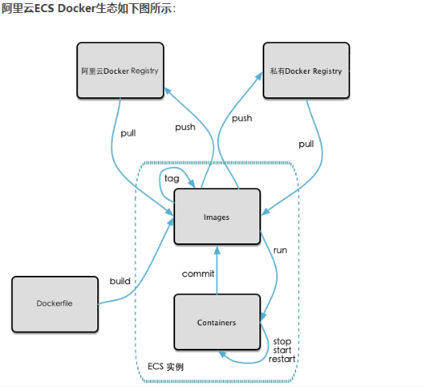

```bash
$docker commit [OPTIONS] 容器ID [REPOSITORY[:TAG]]#从容器中创建一个新的镜像
#登录阿里云Docker Registry
$ sudo docker login --username=shao_xin registry.cn-hangzhou.aliyuncs.com

#将镜像推送到Registry
$ sudo docker login --username=shao_xin registry.cn-hangzhou.aliyuncs.com
$ sudo docker tag [ImageId] registry.cn-hangzhou.aliyuncs.com/wuhshaoxin/shao:[镜像版本号]
$ sudo docker push registry.cn-hangzhou.aliyuncs.com/wuhshaoxin/shao:[镜像版本号]

#Registry中拉取镜像
$ sudo docker pull registry.cn-hangzhou.aliyuncs.com/wuhshaoxin/shao:[镜像版本号]
```

本地镜像的上传：

远程镜像的下载：


## 八 Netty

#### 8.0 NIO

NIO三大核心部分：channel(通道)、buffer(通道)、selector(选择器)


#### 8.1 Netty 的使用场景

> 构建高性能、低时延的各种 Java 中间件，例如 MQ、分布式服务框架、ESB 消息总线等， Netty 主要作为基础通信框架提供高性能、低时延的通信服务； 
>
> 公有或者私有协议栈的基础通信框架，例如可以基于 Netty 构建异步、高性能的 WebSocket 协议栈； 
>
> 各领域应用，例如大数据、游戏等，Netty 作为高性能的通信框架用于内部各模块的数据 分发、传输和汇总等，实现模块之间高性能通信。

#### 8.2 Netty 线程模型

> 首先，Netty 使用 EventLoop 来处理连接上的读写事件，而一个连接上的所有请求都保证 在一个 EventLoop 中被处理，一个 EventLoop 中只有一个 Thread，所以也就实现了一个连 接上的所有事件只会在一个线程中被执行。一个 ventLoopGroup 包含多个 EventLoop，可 以把一个 EventLoop 当做是 Reactor 线程模型中的一个线程，而一个 EventLoopGroup 类似 于一个 ExecutorService

#### 8.3 Netty 的零拷贝

“零拷贝”是指计算机操作的过程中，CPU 不需要为数据在内存之间的拷贝消耗资源。而 它通常是指计算机在网络上发送文件时，不需要将文件内容拷贝到用户空间（User Space）而直接在内核空间（Kernel Space）中传输到网络的方式。

**Netty 内部执行流程**

1. Netty 的接收和发送 ByteBuffer 采用 DIRECT BUFFERS，使用堆外直接内存进行 Socket 读写，不需要进行字节缓冲区的二次拷贝。如果使用传统的堆内存（HEAP BUFFERS）进行 Socket 读写，JVM 会将堆内存 Buffer 拷贝一份到直接内存中，然后才写入 Socket 中。相比于堆外直接内存，消息在发送过程中多了一次缓冲区的内存拷贝。
2. Netty 提供了组合 Buffer 对象，可以聚合多个 ByteBuffer 对象，用户可以像操作一 个 Buffer 那样方便的对组合 Buffer 进行操作，避免了传统通过内存拷贝的方式将几个小 Buffer 合并成一个大的 Buffer。
3. Netty 的文件传输采用了 transferTo 方法，它可以直接将文件缓冲区的数据发送到

## A SpringBoot 案例总结

